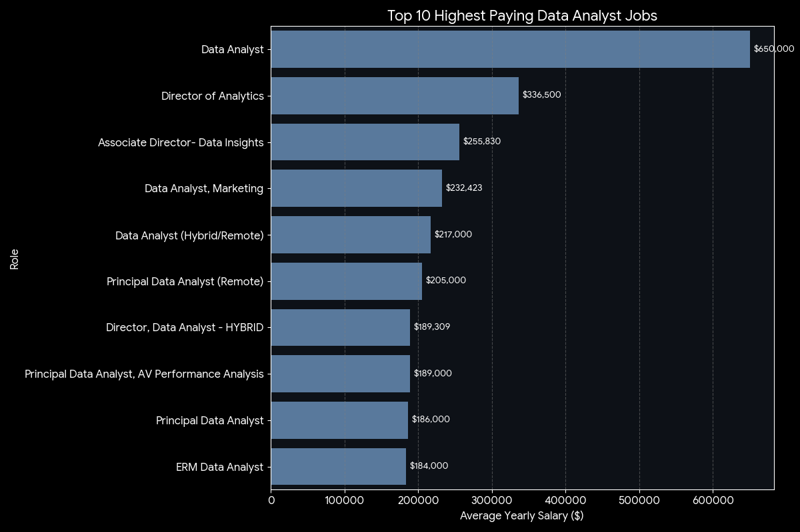
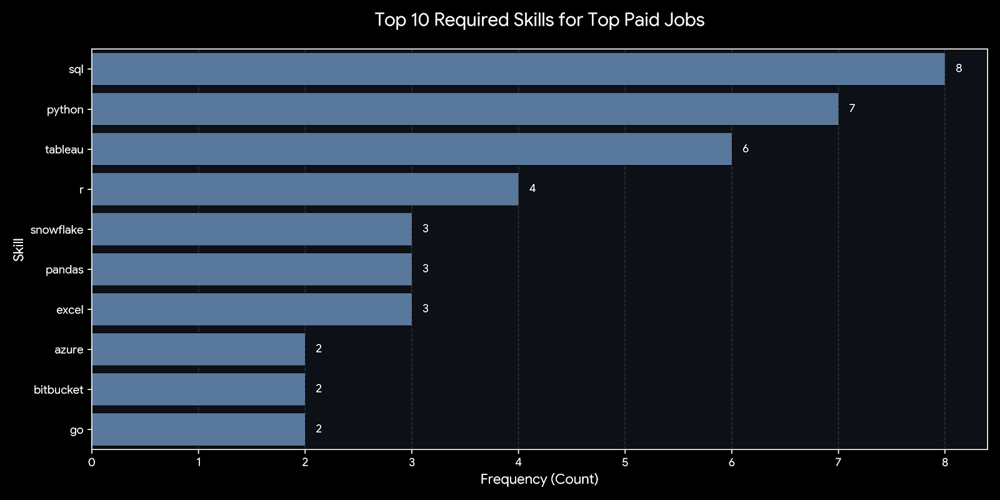
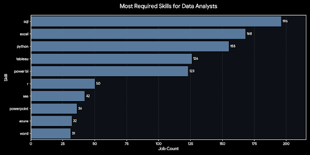
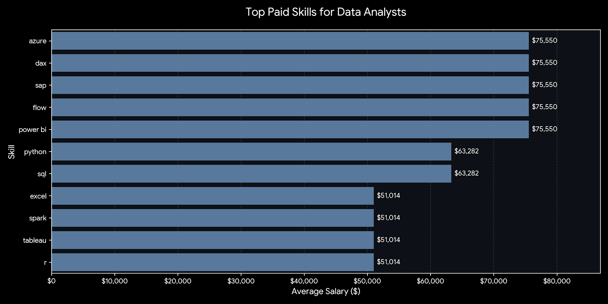
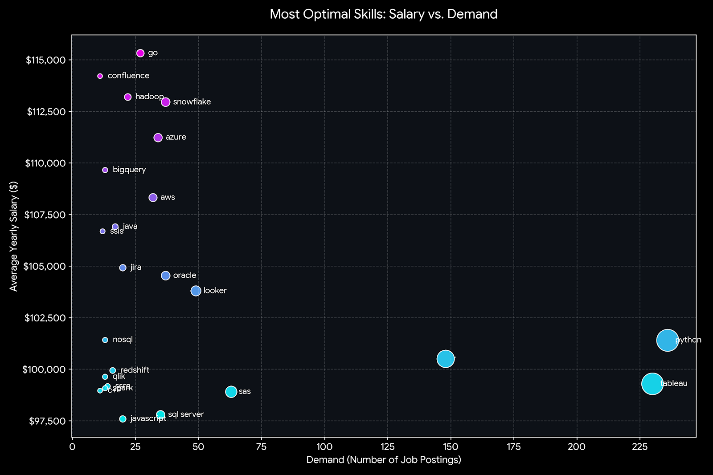

# Data Analyst Job Market Analysis

## Introduction 📊

Navigating the data job market can be disturbing, but data itself holds the answers. 🧩 This project performs a deep dive into job market trends to determine exactly what skills are valued most by employers today.

Using **SQL** ⚡ to analyze job postings, I've made a relationship between different Datasets `company_dim`,`job_postings_fact`,`skills_job_dim` and `skills_dim`.

🔎 SQL queries? Check them out here: [ProjectSQL Folder](/ProjectSQL/)

## Background🧠

Driven by a desire to navigate the wide job market, I wanted to go beyond just normal spoken advice and look at the hard numbers. 📉

By analysing those datasets containing thousands of real-world job postings. By joining `job_postings_fact` and `skills_dim`, I aimed to find the patterns in the Data Analyst hiring process.

This project wasn't just about querying data; it was about solving a real-world problem: identifying the specific skills that bridge the gap between "just a job" and a "top-tier career." 🌉

My approach was to answer the following questions:

1. **What are the top-paying skills?💰**
2. **What are the required skills for the top paid jobs?**
3. **What are the most required skills for Data Analysts?(In Egypt)**
4. **What are the most paid skills for Data analysis(In Egypt)**

5. **What are the most "optimal" skills?** 🎯

This background provides the foundation for the queries and insights that follow, ensuring every conclusion is backed by real-world evidence. 🏛️

## Tools I used

To dive deep into the data and find these insights, I had to use a few key tools:

- **SQL ⚡**:the backbone of my analysis, allowing me to query the database and find essential insights.

- **PostgreSQL** 🐘: The chosen Relational Database Management System (RDBMS), perfect for handling the job posting data.

- **Visual Studio Code** 💻 used for database management and executing SQL queries.

- **Git & GitHub** 🐙: Essential for sharing my SQL scripts and analysis, ensuring project tracking.

## The Analysis

Each query for this project aimed to investigate one specific aspect of the data analyst job market. Here is how I approached each question:

### 1.Top Paying jobs 💸

To determine the highest-paid jobs, I looked at the average salary associated with each job title.

```SQL
SELECT
    job_id,
    job_title,
    job_location,
    job_schedule_type,
    salary_year_avg,
    companies.name AS Company_name,
    job_posted_date::TIMESTAMP
FROM job_postings_fact

LEFT JOIN company_dim AS companies
ON job_postings_fact.company_id = companies.company_id

WHERE
    job_title_short = 'Data Analyst'
    AND
    salary_year_avg IS NOT NULL
    AND
    job_work_from_home = TRUE
ORDER BY
    salary_year_avg DESC

LIMIT 10;
```

- **Analysis:** Ordered job postings by `salary_year_avg` in descending order.

- **Insight:**
  - **Wide Salary Range:** The top 10 highest-paying roles range from $184K to $650K.

  - **Remote Work:** A significant finding is that a wide range of these top-paying roles are remote ("Anywhere"), suggesting location is no longer a barrier to a high paid compensation.
  * **Role Seniority:** While titles like "Director" and "Principal" appear frequently, standard "Data Analyst" titles at specific tech companies (e.g., Mantys, Pinterest) also have elite salary ranges, proving that high compensation isn't limited to management.
    
    *Bar graph visualizing the salary for the top 10 jobs ("Data analysts"); This image was creating by gemini from The SQL query results*

### 2.Required Skills for Top Paid Jobs 💼

To understand what specific skills lead to these high salaries, I analyzed the skills listed in the job descriptions of the top 10 paying roles.

```SQL
WITH Top_paying_jobs AS(
SELECT
    job_id,
    job_title,
    job_location,
    job_schedule_type,
    salary_year_avg,
    companies.name AS Company_name,
    job_posted_date::TIMESTAMP
FROM job_postings_fact

LEFT JOIN company_dim AS companies
ON job_postings_fact.company_id = companies.company_id

WHERE
    job_title_short = 'Data Analyst'
    AND
    salary_year_avg IS NOT NULL
    AND
    job_work_from_home = TRUE

ORDER BY
    salary_year_avg DESC
)
SELECT Top_paying_jobs.job_id,
    job_title,
    salary_year_avg,
    job_location,
    Top_paying_jobs.Company_name,
    job_schedule_type,
    skills_dim.skills
FROM Top_paying_jobs

INNER JOIN skills_job_dim
ON skills_job_dim.job_id= Top_paying_jobs.job_id
INNER JOIN skills_dim
ON skills_dim.skill_id = skills_job_dim.skill_id
    ORDER BY
        salary_year_avg DESC
        LIMIT 25;
```

- **Analysis:**
  " joined the top-paying job postings with the skills_dim table to list every distinct skill required for these positions.

- **Insight:**

1.  **The Dominance of SQL & Python:**
    - **SQL**: It is the non-negotiable language of data. Every single top-paying role in this dataset requires it.

    - **Python:** If you want the high-salary "Principal" or "Director" roles, you cannot rely on **Excel** alone; scripting is essential.

2.  **The "Full Stack" Analyst:**
    - High-paying roles are asking for Data Engineering skills (Snowflake, Azure, AWS, Databricks) alongside analysis. They want people who can get the data, not just analyze it.

    - DevOps Tools: The appearance of Git, Bitbucket, and GitLab confirms that top-tier analysts work in code repositories, likely means collaborating with software engineering teams.

3.  **Visualization:**
    - **Tableau** leads **Power BI** in this specific high-salary slice. This suggests Tableau might be more prevalent in the specific tech/enterprise companies hiring for these top-paid remote roles.

4.  **Soft Skills in Disguise:**

- Tools like **Jira**, **Confluence**, and **PowerPoint** appear frequently. This signals that these roles involve significant project managemen.
  
  _Bar graph visualizing the top skills in data manegment job market; This image was creating by gemini from The SQL query results_

### 3.Most Required Skills for Data Analysts (** In Egypt**)📊

To determine what skills are most critical for getting hired, I calculated the frequency of each skill across all Data Analyst job postings **In Egypt**.

```sql
SELECT
    skills_dim.skills,
    COUNT(job_postings_fact.job_id) AS job_count

FROM
    job_postings_fact
INNER JOIN skills_job_dim
ON skills_job_dim.job_id = job_postings_fact.job_id

INNER JOIN skills_dim
ON skills_dim.skill_id = skills_job_dim.skill_id

WHERE
    job_title_short ='Data Analyst'
    AND
    job_country='Egypt'
GROUP BY
    skills_dim.skills
ORDER BY
    job_count DESC

LIMIT 10;
```

- **Analysis:** I counted the number of job postings associated with each skill in the dataset.
- **Insights:**
  - **SQL is King:** With 196 mentions, SQL is the most required skill. It appears in nearly every job description, proving that database management is the core of the data analysis.
  - **Excel stills Essential:** Despite the rise of advanced tools, Excel is the second most required skill.
  - **Python vs. R:** **Python** was mentioned than 155 times in job postings on the other side **R** was mentioned 50 times showing the significant importnace of **Python** more than **R** in the job Market
  - **Visualization Balance:** **Tableau** was mentioned 126 times while **Power BI** was mentioned 123 times showing the importance of both of them in the job market.
  
  

  _Bar graph visualizing the top skills for Data Analysts in the Egyptian job market; This image was creating by gemini from The SQL query results_

### 4.Top Paid Skills for Data Analysis 📈

To find the highest financial return for Data Analysts, I looked at the average salary associated with various tools in job descriptions.

```sql
SELECT
    skills,
    ROUND(AVG(salary_year_avg),0) AS Salary_Average
    FROM job_postings_fact
    INNER JOIN skills_job_dim
    ON skills_job_dim.job_id = job_postings_fact.job_id
    INNER JOIN skills_dim
    ON skills_dim.skill_id = skills_job_dim.skill_id
WHERE
    job_title_short ='Data Analyst'
    AND
    salary_year_avg IS NOT NULL
    AND
    job_location ='Egypt'

GROUP BY
skills
ORDER BY
Salary_Average DESC
LIMIT 25;
```

- **Analysis:** Calculated the average salary for job postings specifically titled "Data Analyst" **In Egypt**.
- **Insight:**

- **The "Enterprise" Premium:** The highest-paying skills in this list ($75,550) are all heavily tied to the enterprise corporate world, specifically the Microsoft ecosystem (Azure, Power BI, DAX, Flow) and SAP. This suggests that specializing in corporate BI stacks can pay significantly more than general data work.

- **The "Core" Baseline:** Foundational skills like **Python** and **SQL** sit in the middle tier **($63,282)**. While they are required for almost every job (high demand) yet, they still have low salaries.

- **Visualization Tools:** Interestingly, **Power BI** is paying significantly higher than **Tableau** in this specific dataset, probably due to its connection with high-paying **Azure/Microsoft enterprise roles.**

  
  
  _Bar graph visualizing the top paid skills for Data Analysts in the Egyptian job market; This image was creating by gemini from The SQL query results_

### 5.Most "Optimal" Skills 🎯(**general**)

To identify the "sweet spot" for learning, I plotted each skill's demand against its average salary.

```sql
SELECT
    skills_job_dim.skill_id,
    skills,
    COUNT(skills_job_dim.job_id) AS skills_count,
    ROUND(AVG(salary_year_avg),0) AS average_salary
FROM job_postings_fact
INNER JOIN skills_job_dim
ON skills_job_dim.job_id = job_postings_fact.job_id
INNER JOIN skills_dim
ON skills_dim.skill_id = skills_job_dim.skill_id
WHERE
    job_title_short ='Data Analyst'
    AND
    salary_year_avg IS NOT NULL
    AND
    job_work_from_home =TRUE
GROUP BY
    skills,
    skills_job_dim.skill_id
HAVING
    COUNT(skills_job_dim.job_id) > 10
ORDER BY
average_salary DESC,
skills_count DESC

LIMIT 25;
```

- **Analysis**: A scatter plot where the X-axis represents job frequency (Demand) and the Y-axis represents average yearly salary.

- **Insight:**

1. **Python** stands out as the top "optimal" skill. It has the highest demand (236 postings) while maintaining a very high average salary (~$101k). It offers the perfect balance of easy employment and high compensation.

2. Skills like **(Golang)**,**Confluence**, and **Hadoop** are in the upper-left quadrant. This means they are less frequently requested (low demand) but pay exceptionally well (over $113k) when you do find a role. These are excellent targets for specialization after you have mastered the basics.

3. **Tableau** and **R** have high demand (230 and 148 respectively) and respectable salaries (~$99k-$100k). They are safe, reliable skills to build a career on.

4. **Snowflake** sits in a position of moderate demand (37) but very high pay ($113k)indicating it's a rapidly growing, high-value skill worth learning now.



_Scatter plot visualizing the optimal skills for Data Analysts in the job market; This image was creating by gemini from The SQL query results_

## What I learned 🧩

Throughout this project, I built a toolkit of data analysis skills, moving from basic querying to complex decision-making.

- **Advanced SQL:** Mastered complex SQL concepts including LEFT JOIN, CTEs (Common Table Expressions), and aggregation with GROUP BY to extract meaningful insights from raw data.

- **Database Management:** Gained experience in creating tables, managing schemas, and optimizing queries for performance within PostgreSQL.

- **Git & Version Control:** Learned to manage project files, commit changes, and push updates to GitHub for public collaboration.

## Conclusion

### Insights

This analysis provided a clear, data-driven roadmap for navigating the data analyst job market. The findings from my SQL queries consistently point to a few market realities:

- **Specialization Pays:** The highest average salaries (upwards of $100k-$115k) are not attached to generalist tools but to specialized skills like Go, Snowflake, and Hadoop. This suggests that while broad skills get you in the door, niche technical expertise is what drives higher compensation.

- **The Power of Cloud & Big Data:** There is a definitive premium on cloud-native tools (**Azure, AWS, BigQuery**) compared to on-premise or traditional desktop tools. The market is clearly valuing analysts who can operate in cloud environments.

- **The "Optimal" Skill Set:** **Python** proves to be the most versatile tool, sitting in the "sweet spot" of high demand and high salary. Meanwhile, **SQL** remains the foundational bedrock of the industry—the most requested skill across the board.

## Closing Thoughts💭

This project was more than just a technical exercise; it was a practical guide to career planning in data. By analyzing real-world job postings, I've confirmed that the "best" skill to learn depends entirely on your goal: **SQL** for employability, **Python** for versatility, and specialized cloud tools for maximizing earning potential.

As the data landscape evolves, the demand for professionals who can bridge the gap between traditional analysis (Excel/Tableau) and modern engineering (Snowflake/Airflow) will only grow. This analysis serves as a baseline for prioritizing learning to stay competitive in that changing market. 🚀
